# LinkedIn Content Engine

A local app that researches, writes, checks and publishes LinkedIn posts, and helps you comment and reply, with you approving every word.

Built by **[Arun Kirupa](#about-the-author)**, founder of [Pro Marketer](https://www.promarketer.ca). It runs on FastAPI, the Claude API and the LinkedIn REST API. The writing playbooks in `knowledge/` come from [linkedin-skills](https://github.com/sergebulaev/linkedin-skills) by Serge Bulaev (MIT).

📖 **New here?** Read the full **[User Guide](docs/GUIDE.md)**: setup, daily routine, every page explained, and troubleshooting.

---

## Screenshots

| | |
|---|---|
| **Home**: what needs you today, setup checklist, what's coming up, Engage tasks, AI spend<br>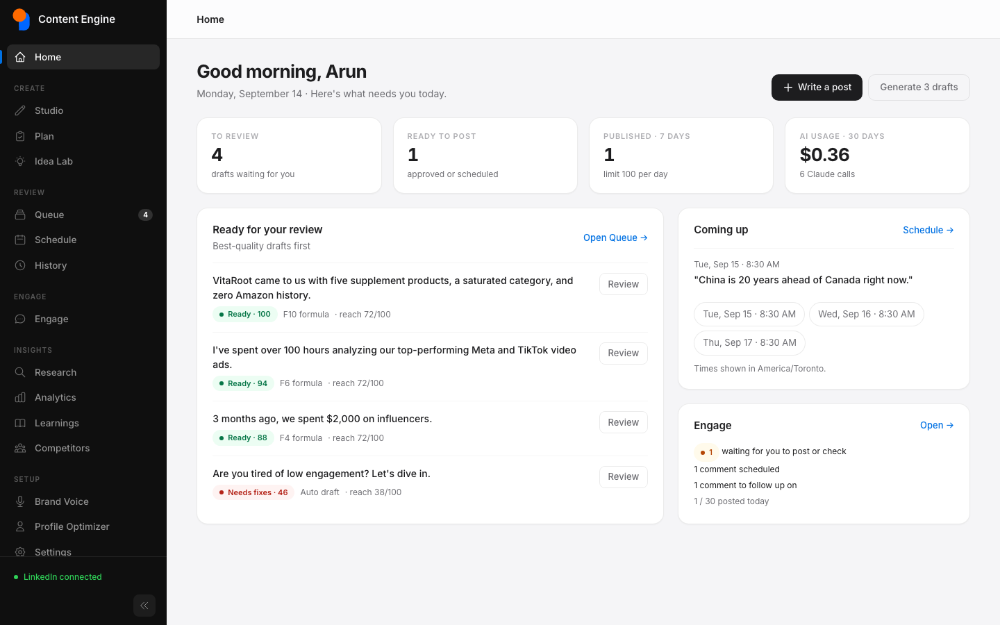 | **Studio**: pick a goal and a proven hook formula, add your facts, get a checked draft with a live LinkedIn preview<br>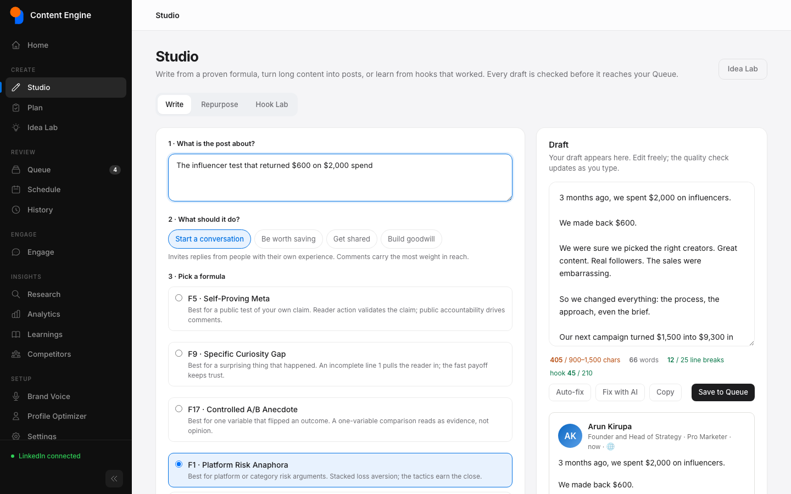 |
| **Queue**: every draft gets a quality score before you approve it<br>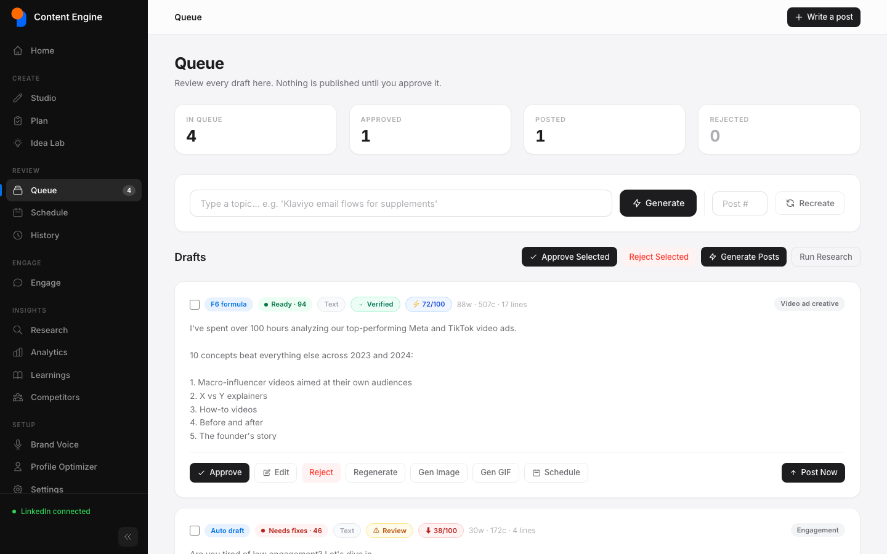 | **Queue editor**: the quality check lists AI tells and reach problems, with Auto-fix and Fix with AI<br>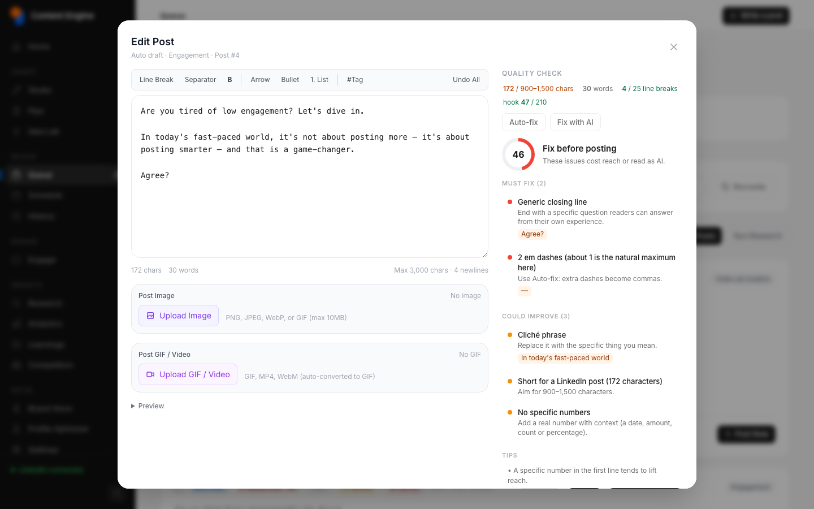 |
| **Plan**: a week of posts across your content pillars; draft any item into the Queue<br>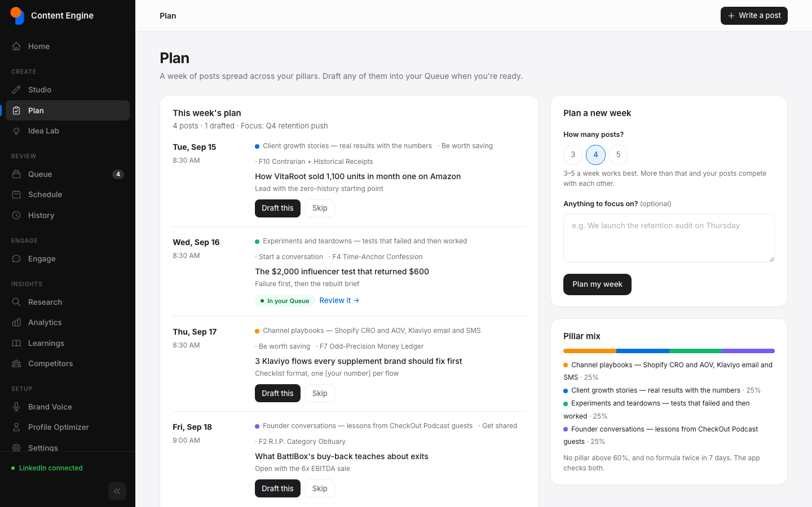 | **Engage**: comments and replies you approved post one at a time, with Copy + Open as a fallback<br>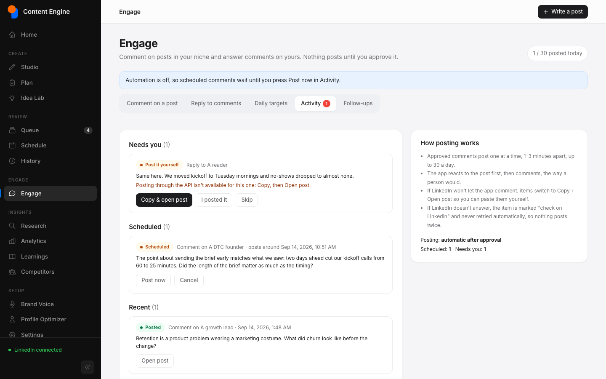 |
| **Brand Voice**: the guided editor for how you sound, plus *Learn my voice* from your own posts<br>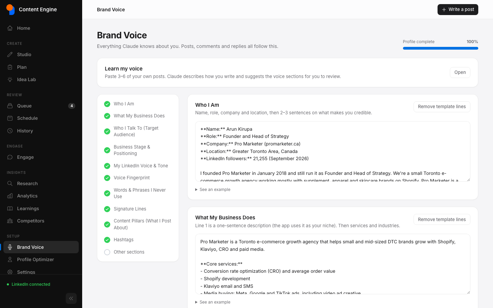 | **Schedule**: posting times and scheduled posts in your timezone<br>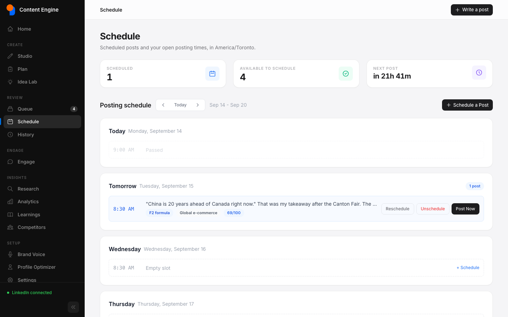 |
| **History**: published posts; type in LinkedIn's numbers so the app learns what works<br>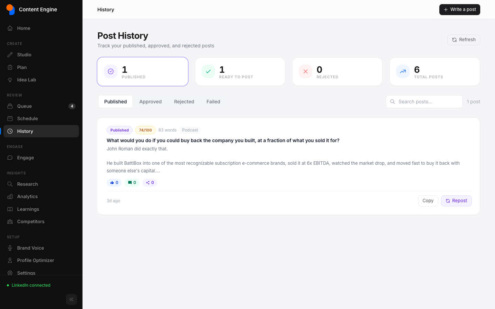 | **Settings**: LinkedIn connection test, limits, posting times, AI usage by feature<br>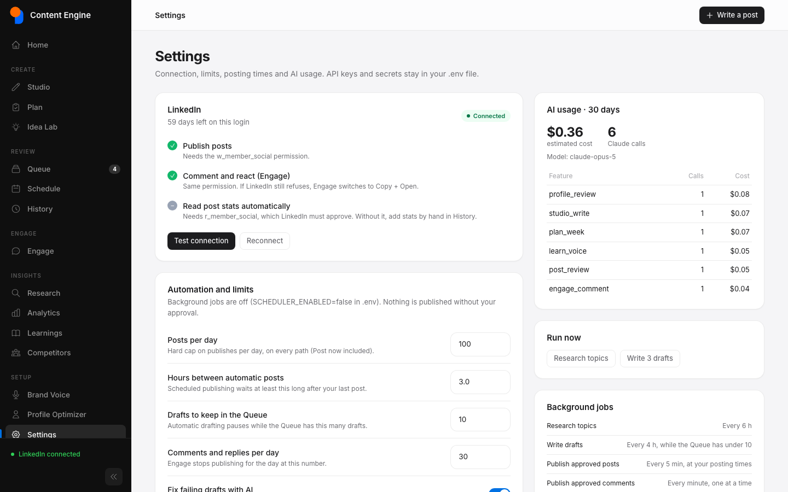 |
| **Profile Optimizer**: a 9-part scorecard with headline, About and experience rewrites<br>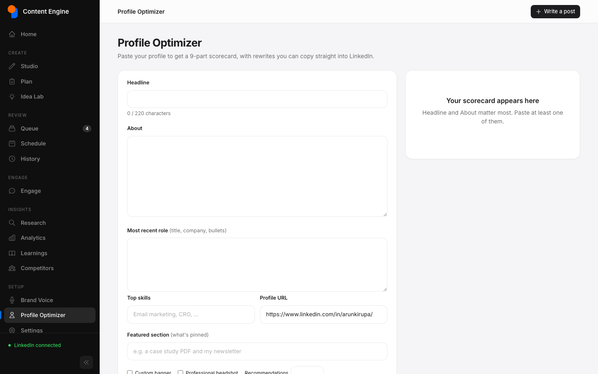 | |

*Screenshots use demo data: posts already published on LinkedIn and a sample queue.*

---

## How it works

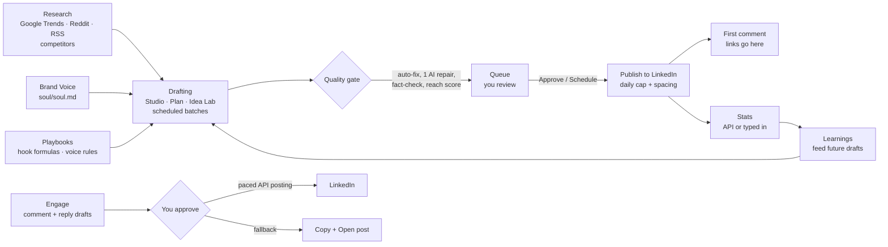

1. **Your voice comes first.** `soul/soul.md`, edited on the **Brand Voice** page, holds who you are, your business, your audience, your pillars, your voice fingerprint and words you never use. Every Claude call gets this as its system prompt, along with the relevant playbooks from `knowledge/`.
2. **Drafts come from four places:**
   - **Studio**: goal → formula → your facts;
   - **Plan**: a guard-railed week of posts;
   - **Idea Lab**: variations of a rough idea;
   - **scheduled batches** from research.
3. **Every draft passes one quality gate:**
   - formatting for LinkedIn (the 25-line limit, clean characters);
   - safe automatic fixes;
   - an AI-tell audit (question openers, reveal bridges, clichés, too many em dashes, links in the body, placeholders);
   - at most one "Fix with AI" pass;
   - a combined fact-check and reach score.
4. **You review in the Queue.** Nothing is published without your approval. Approved posts go out at your posting times, never more than `POSTS_PER_DAY`. If a post has a link, it goes into the **first comment**, which the app posts right after.
5. **The loop closes.** The app learns from real results, either read from LinkedIn (if your app has `r_member_social`) or typed into **History**. Learnings feed back into future drafts. Autoresearch experiments only start after 10 real posts.
6. **Engage grows your reach between posts.** It drafts comments on posts in your niche and replies to comments on yours. Approved items post through the LinkedIn API one at a time, 90–180 seconds apart and under a daily cap. If LinkedIn refuses, everything switches to *Copy + Open post*.

## What's inside

| Area | Page | What it does |
|---|---|---|
| | **Home** | Setup checklist, drafts to review, what's coming up, Engage tasks, AI spend |
| Create | **Studio** | *Write*: goal → proven hook formula (F1–F20) → your facts → draft. *Repurpose*: turn an article, newsletter or transcript into up to 3 posts. *Hook Lab*: see why a hook works and save it as a template |
| | **Plan** | A 3–5 post week across your pillars. No pillar above 60% and no formula twice in 7 days, both enforced in code |
| | **Idea Lab** | Turn a rough idea into several variations |
| Review | **Queue** | Quality score on every draft. The editor shows the issues, a LinkedIn preview with the "…see more" fold, and Auto-fix / Fix with AI |
| | **Schedule / History** | Scheduled and published posts, failed posts with retry, and stats you type in from LinkedIn |
| Engage | **Engage** | Comment on others' posts (T1–T7), reply to comments on yours (R1–R5), daily targets, follow-ups, activity |
| Insights | **Research, Analytics, Learnings, Competitors** | Trending topics, what works for you, competitor patterns. Experiments appear once autoresearch is on |
| Setup | **Brand Voice** | Guided editor for `soul/soul.md`, plus *Learn my voice* |
| | **Profile Optimizer** | 9-part profile scorecard with rewrites |
| | **Settings** | Connection test, limits and toggles, posting times, AI usage by feature |

**Images:** the **Gen Image** button creates a post image with [kie.ai](https://kie.ai) (Nano Banana), or with Google Gemini when only that key is set. Images avoid invented numbers and logos.

## Safety and security

- **Approval gate.** Posts, comments and replies are only published after you approve them. Post now, the scheduler and Engage all enforce it.
- **Limits.** `POSTS_PER_DAY` (default 1) applies on every publish path, plus a minimum gap between automatic posts. `ENGAGE_DAILY_CAP` limits comments, which are spaced out. If LinkedIn doesn't confirm an item, it's marked "check on LinkedIn" and never retried, so nothing posts twice.
- **No invented facts.** Drafts only use your Brand Voice and the notes you give. Missing facts become `[placeholders]`, which block approval until you fill them.
- **Local and locked down.**
  - The app listens on `127.0.0.1` and refuses a network address unless `DASHBOARD_PASSWORD` is set.
  - It only answers requests addressed to `localhost` / `127.0.0.1`, which blocks DNS rebinding.
  - Cross-site requests are blocked, and pages can't be framed by other sites.
  - Server-side fetches only go to public hosts.
- **Untrusted text stays inert.** Scraped and pasted text is marked as untrusted in every prompt and escaped on every page. A test fails the build if a page brings back an unsafe pattern.
- **Secrets stay local.** Keys live in `.env`, which is gitignored. The database, which holds your LinkedIn login, is owner-only. A pre-commit check blocks commits containing keys.

## Quick start

```bash
git clone https://github.com/Only-Pro-Marketer/Linkedin.git
cd Linkedin
python3.12 -m venv .venv
source .venv/bin/activate
pip install -r requirements.txt
cp .env.example .env        # add your keys
python app.py
```

Open **http://localhost:8000** and follow the checklist on Home:

1. Add `ANTHROPIC_API_KEY` to `.env`.
2. Fill in **Brand Voice**. Paste 3–6 of your posts into *Learn my voice* for a head start.
3. **Connect LinkedIn** (Settings → Connect).
4. Check your **posting times** in Settings.
5. Write in **Studio**, review in the **Queue**, and approve.

| Key | Required | Where to get it |
|-----|----------|-----------------|
| `ANTHROPIC_API_KEY` | Yes | [console.anthropic.com](https://console.anthropic.com/) |
| `LINKEDIN_CLIENT_ID` / `LINKEDIN_CLIENT_SECRET` | To publish | [linkedin.com/developers](https://www.linkedin.com/developers/): enable *Sign In with LinkedIn using OpenID Connect* and *Share on LinkedIn*; redirect URL `http://localhost:8000/auth/callback` |
| `KIE_API_KEY` | No | [kie.ai](https://kie.ai/api-key) for post images. Used instead of Gemini when set |
| `APIFY_TOKEN` | No | Optional scraping (competitors, your own posts, fetching comments). Everything also works by pasting |
| `REDDIT_CLIENT_ID` / `GEMINI_API_KEY` | No | Extra research source / Gemini images |

### LinkedIn permissions

- `w_member_social` (default): publish posts, comments and reactions.
- `r_member_social` (needs LinkedIn approval): read post stats automatically. Without it, type the numbers into History.

## Configuration

Secrets live in `.env`. Limits and toggles can also be changed in **Settings**; those values override `.env`.

| Setting | Default | What it does |
|---|---|---|
| `POSTS_PER_DAY` | 1 | Hard cap on publishes per day (1–100) |
| `MIN_HOURS_BETWEEN_POSTS` | 3 | Gap between automatic publishes |
| `ENGAGE_DAILY_CAP` | 30 | Comments and replies per day |
| `SCHEDULER_ENABLED` | true | Background jobs on or off |
| `AUTO_REPAIR` / `FACT_CHECK_ENABLED` | true / true | AI repair pass and fact-check for new drafts |
| `AUTORESEARCH_ENABLED` | false | Claude-scored experiments (idle until 10 real posts) |
| `CLAUDE_MODEL` | claude-opus-5 | Model for every Claude call |
| `KIE_IMAGE_MODEL` / `KIE_IMAGE_ASPECT` | google/nano-banana / 4:5 | Post images |
| `POSTING_TIMEZONE` | America/Toronto | All schedule times use this zone |
| `HOST` / `DASHBOARD_PASSWORD` / `ALLOWED_HOSTS` | 127.0.0.1 / empty / empty | Network exposure; set a password before opening the app to a network |

## What it costs to run

- **Claude:** pay per use. **Settings → AI usage** shows calls and estimated cost by feature for the last 30 days.
- **kie.ai images:** about 4 credits per image with Nano Banana.
- **Apify (optional):** about $0.002 per scraped post, $0.01 per profile and $0.005 per comment. Daily imports cost cents per competitor.
- **LinkedIn API:** free.

## Development

```bash
pip install -r requirements-dev.txt
python -m pytest -q
```

Tests use a temporary database, a fake Claude and mocked LinkedIn, kie.ai and Apify, so they need no keys or network. See [`CLAUDE.md`](CLAUDE.md) for the architecture and the rules the code relies on.

```
app.py                     FastAPI app: middleware, routers, startup recovery
config.py / app_settings.py  .env settings / values edited in Settings
llm.py                     The only place that calls Claude (caching, refusals, usage log)
knowledge/                 Vendored playbooks from linkedin-skills (MIT) + loader
soul/soul.md               Your brand voice
content/                   brand, prompt_builder, pipeline (quality gate), humanizer + quality_rules,
                           ai_fix, review (fact-check + reach score), generator, image_generator, templates/formulas
studio/                    writer, repurposer, hook_lab, planner, voice, profile
engagement/                comment_drafter, reply_handler, publisher (paced API posting), followups
linkedin/                  api_client (posts, comments, reactions), poster (approval gate + limits), url_parser
post_queue/                queue state, scheduler jobs, calendar slots
research/ analytics/ autoresearch/   research sources (incl. optional Apify), learning loop, experiments
dashboard/                 routers/, routes.py, security.py, templates/, static/js (app.js, post-editor.js)
database/                  models, engine (SQLite WAL), migrations (versioned, backed up)
tests/                     pytest suite
```

Post status flow: `QUEUED → APPROVED → (SCHEDULED) → POSTING → POSTED`, or `REJECTED` / `FAILED` (with retry).

---

## About the author

**Arun Kirupa** is the Founder and Head of Strategy at **[Pro Marketer](https://www.promarketer.ca)**, a Toronto e-commerce growth agency he started in 2018.

- Helps e-commerce owners grow with the proprietary **Growth Trust Model®**: a 90-day plan built around CRO, AOV, retention and paid media.
- Shopify specialist for **supplement, apparel and skincare** brands. Pro Marketer is a **Klaviyo Partner** and a **Zoho Authorized Partner**.
- Host of the **Pro Marketer CheckOut Podcast**, where he interviews e-commerce founders.
- Founder of the **"DTC Owner" community** on Skool.
- Previously a contract CMO leading a 40+ person marketing team.

He built this engine to run his own LinkedIn the way he runs client growth: a clear process, real numbers, and a human approving every word.

- LinkedIn: [linkedin.com/in/arunkirupa](https://www.linkedin.com/in/arunkirupa/)
- Website: [promarketer.ca](https://www.promarketer.ca)

## License

MIT, see [LICENSE](LICENSE). `knowledge/` is adapted from linkedin-skills by Serge Bulaev (MIT, see `knowledge/LICENSE`).
